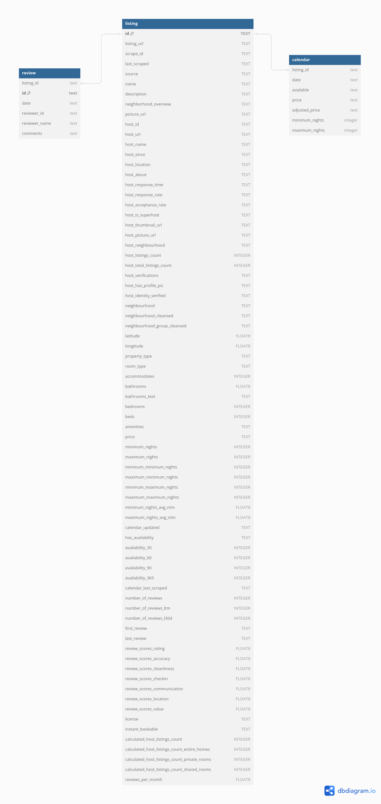

# Data cleaning & transformation

<a href="https://www.flaticon.com/free-icons/airbnb" title="airbnb icons">Airbnb icons created by riajulislam - Flaticon</a>

## **Table of content**

- [Summary](#summary)
- [Introduction](#introduction)
- [Data understanding](#data-understanding)
	- [Initial data collection](#initial-data-collection)
	- [Data description](#data-description)
	- [Data exploration](#data-exploration)
	- [Data quality](#data-quality)
- [Data preparation](#data-preparation)
	- [Format data](#format-data)
- [Results](#results)
- [Conclusion](#conclusion)
- [References](#references)
- [Appendix](#appendix)

## **Summary**

### **Goal**

Produce high quality data for Airbnb listings from Boston, MA. This data could help a data analyst to understand the current short-term rental market, providing insights that will guide the expansion of a real state company or individual.

### **Process**

I stored the data locally, then created a PostgreSQL database with multiple tables representing different elements of the data. Finally, I applied several techniques and methods to ensure data quality.

### **Highlights**

## **Introduction**

This project aims to generate high-quality data using different techniques and methods. This data can assist a data analyst in understanding the current short-term rental market to guide the expansion of a real state company or individual.

I have selected PostgreSQL as my primary tool to take advantage of its features and showcase my expertise.

The project methodology is based on CRISP-DM (Cross-Industry Standard Process for Data Mining) [1], incorporating only the components that aligns with project's objective.

## **Data understanding**

### Initial data collection

I collected the data from Inside Airbnb [2], a mission-driven project that provides data about Airbnb's listings for the upcoming 12 months, which is updated quarterly. I specifically chose data from Boston, MA, downloaded it manually, and saved it locally.

### Data description

The Boston Airbnb data is stored in .csv format. It contains 7 files representing different aspects of the data. Three of them represent detailed data about listings (`listings.csv`) including their availability in the next 12 months (`calendar.csv`), and past reviews (`reviews.csv`). The next three, represents a summarized version of the detailed data. The remaining two, represents geographical information for the neighborhoods (`neighbourhoods.csv`, `neighbourhoods.geojson`). I select only the first three files containing data that align with the project’s objective.

The files have a varying numbers of fields and observations. `listings.csv` has 75 fields and 4,261 observations. `calendar.csv` contains 7 fields and 1,554,256 observations. And, `reviews.csv` file contains 6 fields and 186,496 observations.

The `listing.csv` file contains 4 different types of information. The first type is related to the uniqueness of the data (`listing_id`). The second type is related to listing key performance metrics (KPIs), with columns like `number_of_reviews`, `number_of_reviews_ltm`, and so on. The third type contains host information with columns like `host_id`, `host_url`, and more. The final type of information is related to the property like `bathrooms`, `bedrooms`, and others. The table below provides detailed information about each column.

| Attribute               | Description                                                                                   |
|-------------------------|-----------------------------------------------------------------------------------------------|
| id                      | Unique identifier for each record.                                                          |
| listing_url             | URL of the listing page on the Airbnb website.                                              |
| scrape_id               | Identifier used during data scraping process.                                               |
| last_scraped            | Timestamp indicating the last time the data was scraped.                                      |
| source                  | Source of the data, e.g., Airbnb API, web scraping.                                           |
| name                    | Name of the listing.                                                                          |
| description             | Detailed description of the listing.                                                          |
| neighborhood_overview   | Overview of the neighborhood where the listing is located.                                    |
| picture_url             | URL of the main picture associated with the listing.                                         |
| host_id                 | Unique identifier for the host.                                                            |
| host_url                | URL of the host's profile page on the Airbnb website.                                        |
| host_name               | Name of the host.                                                                          |
| host_since              | Date since the host started hosting on Airbnb.                                             |
| host_location           | Location of the host.                                                                      |
| host_about              | About section of the host's profile, providing information about the host.                    |
| host_response_time      | Average response time of the host to inquiries.                                             |
| host_response_rate      | Host's response rate based on guest feedback.                                                |
| host_acceptance_rate    | Percentage of bookings accepted by the host.                                                 |
| host_is_superhost       | Boolean indicating if the host is a Superhost.                                               |
| host_thumbnail_url     | URL of the host's thumbnail image.                                                           |
| host_picture_url        | URL of the host's profile picture.                                                           |
| host_neighbourhood      | Neighbourhood where the host resides.                                                       |
| host_listings_count     | Number of listings hosted by the host.                                                        |
| host_total_listings_count | Total number of listings hosted by the host across all platforms.                             |
| host_verifications      | Array of verification statuses for the host.                                                  |
| host_has_profile_pic    | Boolean indicating if the host has a profile picture.                                          |
| host_identity_verified  | Boolean indicating if the host's identity has been verified.                                   |
| neighbourhood           | Name of the neighbourhood where the listing is located.                                        |
| neighbourhood_cleansed  | Cleaned version of the neighbourhood name.                                                     |
| neighbourhood_group_cleansed | Cleansed group name of the neighbourhood.                                                     |
| latitude                | Latitude coordinate of the listing's location.                                                |
| longitude               | Longitude coordinate of the listing's location.                                                |
| property_type           | Type of property (e.g., apartment, house).                                                   |
| room_type               | Type of room within the property (e.g., private room, entire home).                            |
| accommodates           | Maximum number of guests the listing can accommodate.                                        |
| bathrooms               | Number of full bathrooms in the listing.                                                      |
| bathrooms_text          | Textual representation of bathroom count (e.g., "1 full bath").                              |
| bedrooms                | Number of bedrooms in the listing.                                                           |
| beds                    | Number of beds available in the listing.                                                     |
| amenities               | Array of amenities offered by the listing.                                                    |
| price                   | Price per night for the listing.                                                             |
| minimum_nights          | Minimum number of nights a booking can be made for.                                            |
| maximum_nights          | Maximum number of nights a booking can be made for.                                            |
| minimum_minimum_nights  | Minimum number of nights a booking can be made for, considering minimum nights policy.         |
| maximum_minimum_nights  | Maximum number of nights a booking can be made for, considering minimum nights policy.         |
| minimum_maximum_nights | Minimum number of nights a booking can be made for, considering maximum nights policy.         |
| maximum_maximum_nights | Maximum number of nights a booking can be made for, considering maximum nights policy.         |
| minimum_nights_avg_ntm  | Minimum average number of nights booked over the past year.                                     |
| maximum_nights_avg_ntm  | Maximum average number of nights booked over the past year.                                     |
| calendar_updated        | Timestamp indicating the last update to the listing's calendar.                                |
| has_availability        | Boolean indicating if the listing currently has availability.                                  |
| availability_30         | Availability percentage for the next 30 days.                                                 |
| availability_60         | Availability percentage for the next 60 days.                                                 |
| availability_90         | Availability percentage for the next 90 days.                                                 |
| availability_365        | Availability percentage for the next 365 days.                                                |
| calendar_last_scraped   | Timestamp indicating the last time the listing's calendar was scraped.                         |
| number_of_reviews        | Total number of reviews left for the listing.                                                 |
| number_of_reviews_ltm    | Number of reviews left for the listing over the last 12 months.                                 |
| number_of_reviews_l30d   | Number of reviews left for the listing over the last 30 days.                                  |
| first_review            | Date of the first review received for the listing.                                            |
| last_review             | Date of the most recent review received for the listing.                                      |
| review_scores_rating    | Overall rating score for the listing, out of 5.                                                |
| review_scores_accuracy   | Accuracy score for the listing, out of 5.                                                     |
| review_scores_cleanliness | Cleanliness score for the listing, out of 5.                                                 |
| review_scores_checkin    | Check-in experience score for the listing, out of 5.                                           |
| review_scores_communication | Communication score for the listing, out of 5.                                                |
| review_scores_location  | Location score for the listing, out of 5.                                                      |
| review_scores_value     | Value for money score for the listing, out of 5.                                               |
| license                 | License type for the listing.                                                                |
| instant_bookable        | Boolean indicating if the listing allows instant booking.                                      |
| calculated_host_listings_count | Calculated total number of listings hosted by the host across all platforms.                  |
| calculated_host_listings_count_entire_homes | Calculated number of entire homes hosted by the host.                                        |
| calculated_host_listings_count_private_rooms | Calculated number of private rooms hosted by the host.                                        |
| calculated_host_listings_count_shared_rooms | Calculated number of shared rooms hosted by the host.                                        |
| reviews_per_month       | Average number of reviews received per month.

The `calendar.csv` file contains 2 different types of information. The first type is related to dates. The second type contains listing information with variables like `price`, `minimum_nights`, and so on. The table below provides detailed information about each column.

| Attribute      | Description                                                                                |
|----------------|--------------------------------------------------------------------------------------------|
| listing_id     | Unique identifier for each listing.                                                        |
| date           | Date when the listing information was recorded or updated.                                 |
| available      | Boolean value indicating whether the listing is currently available for booking.           |
| price          | Original price per night for the listing.                                                  |
| adjusted_price | Adjusted price per night for the listing, taking into account discounts or special offers. |
| minimum_nights | Minimum number of nights a booking can be made for.                                        |
| maximum_nights          | Maximum number of nights a booking can be made for.

The `reviews.csv` file only contain relevant information of past reviews for a particular listing. The table below provides detailed information about each column.

| Attribute               | Description                                                                                   |
|-------------------------|-----------------------------------------------------------------------------------------------|
| listing_id              | Unique identifier for each listing.                                                          |
| id                       | Internal identifier for the review entry.                                                   |
| date                     | Date when the review was submitted.                                                         |
| reviewer_id             | Unique identifier for the reviewer who wrote the review.                                     |
| reviewer_name           | Name of the reviewer who wrote the review.                                                   |
| comments                | Comments or feedback provided by the reviewer regarding the listing.                          |

The data from the source was organized into tables within a robust database, establishing relationships between the various datasets. The following illustration (ERD) provides a representation of the database's structure.

.

### Data exploration

The dataset has 4102 active listings as of March 24, 2024. They are distributed across 121 neighborhoods and belong to 1,228 hosts. Of these hosts, 522 (42.50%) are classified as superhosts, while 706 (57.49%) are regular hosts. It's important to note that one factor to consider when evaluating a property for short-term rental investment is to avoid locations with a lot of professional hosts [3]. There are 28 of them representing 2.04% of all hosts, and they own 42.63% of listings.

If we look more into how properties are set up, most of them are entire rental units (49.26%). These mostly accommodate two guests (42.05%), have one bathroom (61.18%), one bed (49.24%). The top five popular amenities, present in more than 90% of listings, include smoke alarms, carbon monoxide alarms, Wifi, essentials, and hot water present.

The dataset exhibits promising characteristics for a good short-term investment. These attributes could lead to a higher annual revenue by maintaining superhost status. By retaining this status, we may have a 13% higher annual revenue potential than regular hosts [4]. In the past year, Boston's superhost received an average of 21 reviews, with an average review score of 4.86 and an average response rate of over 90%. These criteria are crucial for maintaining superhost status [5].

Superhosts and regular hosts have similar average nightly rates. The average nightly rates are 194.05 for superhosts and 186.43 for regular hosts.

I explored the connection between quantitative and qualitative variables and the nightly rate, given that this metric can be valuable for calculating key performance indicators (KPI). The analysis revealed a moderate positive correlation (0.5 < r < 0.7) between price and the number of beds, bedrooms, bathrooms, and accommodations. This indicates that as the count of these variables increases, the nightly rate also increases.

### Data quality

The dataset present some problems:

1. Inappropiate data types: Present in every table.
2. Blank values: Present in every table.
3. Missing values: Present in the listing and calendar table. Their presence varies from low, high or absolute degree in some variables.

## **Data preparation**

## **Format data**

After setting an appropiate format for the data. The `listing` table has now appropiate format for every column as seen next.

| column_name                      | data_type          |
|----------------------------------|--------------------|
| listing_url                      | text               |
| source                           | text               |
| name                             | text               |
| description                      | text               |
| neighborhood_overview            | text               |
| picture_url                      | text               |
| host_url                         | text               |
| host_name                        | text               |
| host_location                    | text               |
| host_about                       | text               |
| host_response_time               | text               |
| host_thumbnail_url               | text               |
| host_picture_url                 | text               |
| host_neighbourhood               | text               |
| host_listings_count              | integer            |
| host_total_listings_count        | integer            |
| neighbourhood                    | text               |
| neighbourhood_cleansed           | text               |
| neighbourhood_group_cleansed     | text               |
| latitude                         | double precision   |
| longitude                        | double precision   |
| property_type                    | text               |
| room_type                        | text               |
| accommodates                     | integer            |
| bathrooms                        | double precision   |
| bathrooms_text                   | text               |
| bedrooms                         | integer            |
| beds                             | integer            |
| minimum_nights                   | integer            |
| maximum_nights                   | integer            |
| minimum_minimum_nights           | integer            |
| maximum_minimum_nights           | integer            |
| minimum_maximum_nights           | integer            |
| maximum_maximum_nights           | integer            |
| minimum_nights_avg_ntm           | double precision   |
| maximum_nights_avg_ntm           | double precision   |
| calendar_updated                 | text               |
| has_availability                 | text               |
| availability_30                  | integer            |
| availability_60                  | integer            |
| availability_90                  | integer            |
| availability_365                 | integer            |
| calendar_last_scraped            | text               |
| number_of_reviews                | integer            |
| number_of_reviews_ltm            | integer            |
| number_of_reviews_l30d           | integer            |
| first_review                     | text               |
| last_review                      | text               |
| review_scores_rating             | double precision   |
| review_scores_accuracy           | double precision   |
| review_scores_cleanliness        | double precision   |
| review_scores_checkin            | double precision   |
| review_scores_communication      | double precision   |
| review_scores_location           | double precision   |
| review_scores_value              | double precision   |
| license                          | text               |
| instant_bookable                 | text               |
| calculated_host_listings_count   | integer            |
| calculated_host_listings_count_entire_homes | integer |
| calculated_host_listings_count_private_rooms | integer |
| calculated_host_listings_count_shared_rooms  | integer |
| reviews_per_month                | double precision   |
| host_response_rate               | numeric            |
| host_acceptance_rate             | numeric            |
| host_is_superhost                | boolean            |
| host_verifications               | ARRAY              |
| host_has_profile_pic             | boolean            |
| host_identity_verified           | boolean            |
| amenities                        | ARRAY              |
| price                            | double precision   |
| id                               | bigint             |
| scrape_id                        | bigint             |
| last_scraped                     | date               |
| host_id                          | bigint             |
| listing_id                       | bigint             |
| host_since                       | date               |

 The `calendar` table has now appropiate format for every column as seen next.

| column_name       | data_type          |
|-------------------|--------------------|
| adjusted_price    | text               |
| listing_id        | bigint             |
| price             | double precision   |
| available         | boolean            |
| minimum_nights    | integer            |
| maximum_nights    | integer            |
| date              | date               |

 The `review` table has now appropiate format for every column as seen next.

| column_name    | data_type |
|---------------|-----------|
| reviewer_name | text      |
| comments      | text      |
| listing_id    | bigint    |
| id            | bigint    |
| date          | date      |
| reviewer_id   | bigint    |

## References

[1] N. Hotz, “What is CRISP DM?,” Data Science Project Management, Jan. 19, 2023. https://www.datascience-pm.com/crisp-dm-2/ (accessed May 14, 2024).
‌

[2] Airbnb, “Inside Airbnb” Inside Airbnb. https://insideairbnb.com/ (accessed May 14, 2024).

[3] Airdna, “How to find a good short-term rental investment location | AirDNA,” airdna. https://www.airdna.co/guides/find-good-short-term-rental-locations (accessed May 30, 2024).

[4] Airdna, "Airbnb Superhost: How to Become One in 2024”, AirDNA - Short-Term Vacation Rental Data and Analytics, Apr. 7, 2024. https://www.airdna.co/blog/airbnb_superhost_status (accessed May 30, 2024).

[5] Airbnb, “How to become a Superhost - Airbnb Help Center,” Airbnb. https://www.airbnb.com/help/article/829 (accessed May 30, 2024)
